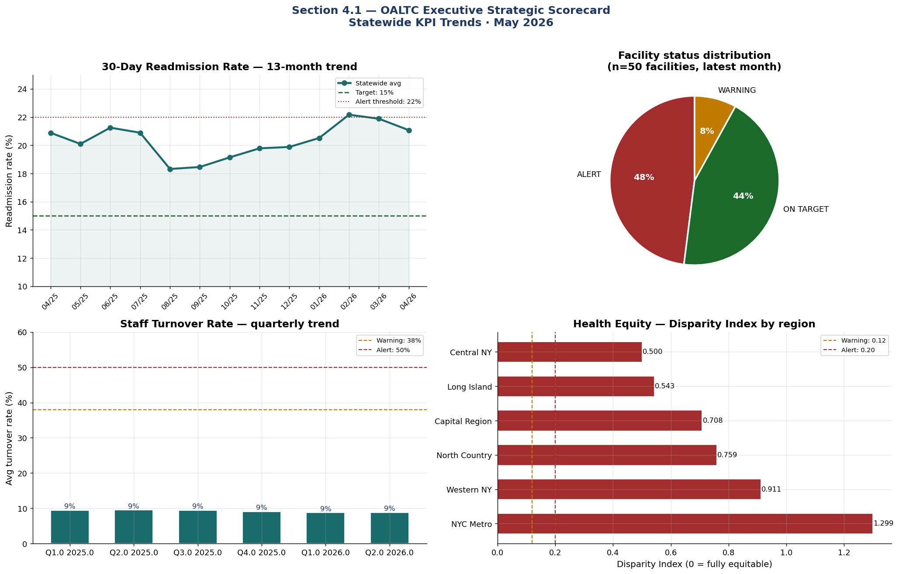

#  Executive Strategic Scorecard

Tier 1 KPIs aggregated to **statewide level**, presented as a quarterly briefing
suitable for DOH Commissioner and OALTC Director.

**Output**

```text
<Figure size 1920x1200 with 4 Axes>

Figure saved: fig_executive_scorecard.png
```

The above figure provides an executive-level overview of key performance indicators (KPIs) for the nursing home system, as of the most recent quarter:

1. **30-Day Readmission Rate (Panel 1)**: The upper left panel shows the historical trend of the 30-day hospital readmission rate across all facilities. Threshold lines indicate the cutoffs for "Warning" (15%) and "Alert" (18%) status. Higher rates signal potential issues in quality of care or care transitions.

2. **Facility Status Distribution (Panel 2)**: The upper right panel visualizes the proportion of facilities in "ALERT," "WARNING," or "GOOD" status based on their composite performance. A higher proportion of "ALERT" facilities indicates widespread areas for urgent improvement.

3. **Staff Turnover Rate Trend (Panel 3)**: The lower left panel tracks turnover rates for direct care staff on a quarterly basis. Reference lines at 38% (Warning) and 50% (Alert) highlight at-risk levels of workforce instability.

4. **Health Equity — Disparity Index by Region (Panel 4)**: The lower right panel illustrates average disparity index values (a measure of inequities in resident outcomes) by region. Regions above the Alert threshold require targeted interventions to address inequalities.

The figure supports rapid identification of system-level risks and guides executive attention to both overall performance trends and structural disparities across regions.

### Scorecard summary table (for Commissioner briefing)

**Output**

```text
Executive Scorecard Summary — Q1 2026
===========================================================================

        Strategic Pillar                                 KPI  Value  Target  \
0        Quality of Care             30-Day Readmission Rate  17.1%   ≤ 15%   
1    Workforce Stability                 Staff Turnover Rate   8.7%   ≤ 35%   
2  Regulatory Compliance  Complaint Investigation Timeliness   nan%   ≥ 90%   
3          Health Equity             Outcome Disparity Index  0.870  ≤ 0.12   

    Status # Facilities in Alert  
0  WARNING                    14  
1  WARNING                     0  
2  WARNING                     0  
3    ALERT    N/A (regional KPI)
```

The table shown above summarizes overall system performance by strategic pillar, highlighting the latest values for each key KPI, the established target, the current status (GOOD, WARNING, or ALERT), and how many facilities are in "Alert" status for that KPI. This summary is designed for executive/commissioner review, making it easy to quickly identify which areas (quality of care, workforce, regulatory compliance, or health equity) require urgent attention and intervention. The "Health Equity" pillar uses a regional KPI, so the "# Facilities in Alert" column shows "N/A". The data give a snapshot of system-level risks and priority areas.


{fig-alt="Executive strategic scorecard"}
