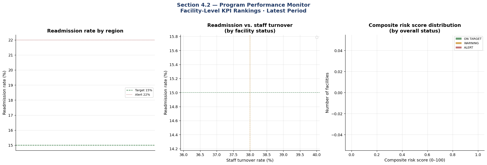

# Program Performance Monitor — Facility Rankings

Tier 2 KPIs at facility level. Used by Bureau Chiefs and Program Managers
for weekly performance review and targeting of support resources.

**Output**

```text
Top 10 Highest-Risk Facilities — Immediate Review Recommended
================================================================================

   facility_id                   facility_name          region  licensed_beds  \
28      NH-029        Oyster Bay Care Center 5     Long Island            190   
41      NH-042       Plattsburgh Care Center 7   North Country            110   
21      NH-022          Brooklyn Care Center 4       NYC Metro             68   
30      NH-031           Buffalo Care Center 6      Western NY             74   
37      NH-038              Rome Care Center 7      Central NY            151   
23      NH-024            Malone Care Center 4   North Country             92   
8       NH-009  Saratoga Springs Care Center 2  Capital Region            190   
42      NH-043          Lockport Care Center 8      Western NY            177   
39      NH-040     Staten Island Care Center 7       NYC Metro            175   
15      NH-016             Bronx Care Center 3       NYC Metro            103   

         ownership  readmission_rate_pct  turnover_rate_pct  \
28  Not-for-profit                 45.83                8.3   
41  Not-for-profit                 35.71                6.9   
21      Government                 36.67                3.1   
30      Government                 35.29                5.6   
37      Government                 32.08               13.3   
23      Government                 33.33                9.8   
8   Not-for-profit                 30.00               11.3   
42      Government                 29.79                8.3   
39  Not-for-profit                 26.19               17.2   
15  Not-for-profit                 30.00                4.5   

    timeliness_rate_pct  composite_risk_score overall_status  
28                  NaN                  73.7          ALERT  
41                  NaN                  58.5          ALERT  
21                  NaN                  57.8          ALERT  
30                  NaN                  57.2          ALERT  
37                  NaN                  56.7          ALERT  
23                  NaN                  56.6          ALERT  
8                   NaN                  52.7          ALERT  
42                  NaN                  50.8          ALERT  
39                  NaN                  50.4          ALERT  
15                  NaN                  49.0          ALERT


Average KPI performance by ownership type:

                n_facilities  avg_readmit_rate  avg_turnover_rate  \
ownership                                                           
For-profit                13             17.86               8.97   
Government                17             23.17               8.06   
Not-for-profit            20             21.38               9.44   

                avg_complaint_rate  avg_risk_score  pct_alert  
ownership                                                      
For-profit                     NaN           34.08      38.46  
Government                     NaN           41.19      58.82  
Not-for-profit                 NaN           39.37      45.00
```

The table above lists the top 10 highest-risk facilities, ranked by their composite risk score.
Facilities in this table are prioritized for immediate review.
The summary table below provides an overview of average KPI performance by facility ownership type,
showing how factors such as readmission rate, staff turnover, complaint timeliness, risk score,
and the proportion of facilities in 'ALERT' status vary by ownership group.


{fig-alt="Program performance monitor"}
