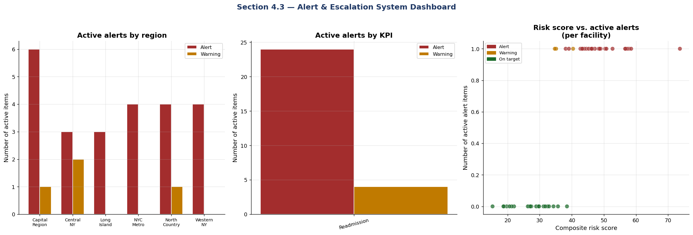

# Alert & Escalation System

This section introduces an automated system designed to flag nursing home facilities that breach established KPI thresholds. The alert system provides structured escalation and clear response timelines based on the severity and persistence of performance issues:

- **Alert Detection:** The system continuously monitors KPIs (such as 30-day readmission rate, staff turnover, and complaint investigation timeliness) for each facility. When a facility’s KPI exceeds (or falls below, if lower is better) specific thresholds, the system generates an alert.

- **Tiered Escalation Levels:**
    - **ALERT:** Triggered when a facility breaches a KPI threshold for two or more consecutive periods (e.g., months or quarters). Assigns responsibility to the Bureau Chief or Program Director, requiring action within 2 days. Implies the need for urgent investigation and intervention.
    - **WARNING:** Triggered when a threshold is breached in the most recent period only. Assigns responsibility to the Program Manager, with a recommended response within 5 days. Indicates emerging risk.
    - **ON TARGET:** No action required; the facility is operating within target ranges.

- **Automated Assignments and Timelines:** Each alert record specifies the required escalation level, the assigned responder, and the due date for follow-up, ensuring accountability and timely corrective action.

This proactive alerting and escalation framework aims to enable faster detection and resolution of quality, staffing, and compliance problems, supporting data-driven oversight and improving resident outcomes.

### Alert Generation Engine

This section introduces the logic that automatically scans facility KPIs and determines
whether any performance thresholds have been breached. Facilities that exceed risk limits—for example,
if their 30-day readmission rate or staff turnover is too high, or their complaint investigation timeliness
is too low—are flagged with an alert or warning based on the severity.
The logic not only identifies which KPI was breached, but also assigns escalation levels (ALERT vs. WARNING),
recommends which staff role should be responsible for follow-up, and sets a target due date for corrective action.

This automated alert generation ensures that at-risk facilities are prioritized for intervention and that
accountability and response timelines are clearly defined.

**Output**

```text
Alert System — Active Log
=======================================================
  Active ALERTS  :  14  (response required within 2 business days)
  Active WARNINGS:  10  (response required within 5 business days)
  Total items    :  24

Alerts by KPI:
alert_level              ALERT  WARNING
kpi_name                               
30-Day Readmission Rate     14       10
```

The output above displays both a summary and a breakdown of active alerts and warnings generated by the alert system.

After generating a dataframe (`df_alerts`) containing all current alerts and warnings for each facility and relevant KPI,
the code prints:

- The total number of "ALERTS" (critical items, requiring a response within 2 business days)
- The total number of "WARNINGS" (moderate items, response due within 5 business days)
- The overall number of active alert items
- A detailed table showing how many alerts and warnings exist for each KPI tracked in the system

This reporting provides a quick operational perspective on where immediate attention or follow-up is required.

### Alert Visualization

**Output**

```text
<Figure size 2160x720 with 3 Axes>
```

The figure above provides a dashboard summary of the current facility alert landscape:
- The first panel shows the number of active ALERT and WARNING items for each region, highlighting which areas have the most urgent concerns.
- The second panel displays the count of active alerts by each KPI, helping to identify which KPIs are most frequently in alert or warning status.
- The third panel plots each facility’s composite risk score against the number of active alert items, with color-coding for alert status, showing how risk scores correspond to the volume of active issues.
This visualization gives a quick, actionable view for tracking regions, KPIs, and facilities that need attention.

### Full Alert Log

**Output**

```text
Active Alert Log — Top 20 items by priority
==========================================================================================

   alert_level facility_id                   facility_name          region  \
6        ALERT      NH-015       Glens Falls Care Center 3  Capital Region   
22       ALERT      NH-045       Glens Falls Care Center 8  Capital Region   
9        ALERT      NH-027              Troy Care Center 5  Capital Region   
21       ALERT      NH-044            Auburn Care Center 8      Central NY   
12       ALERT      NH-032             Utica Care Center 6      Central NY   
3        ALERT      NH-011         Hempstead Care Center 2     Long Island   
18       ALERT      NH-041         Hempstead Care Center 7     Long Island   
23       ALERT      NH-046             Bronx Care Center 8       NYC Metro   
8        ALERT      NH-022          Brooklyn Care Center 4       NYC Metro   
10       ALERT      NH-028            Queens Care Center 5       NYC Metro   
17       ALERT      NH-040     Staten Island Care Center 7       NYC Metro   
11       ALERT      NH-030            Canton Care Center 5   North Country   
7        ALERT      NH-019           Batavia Care Center 4      Western NY   
4        ALERT      NH-013          Lockport Care Center 3      Western NY   
16     WARNING      NH-039  Saratoga Springs Care Center 7  Capital Region   
13     WARNING      NH-033       Schenectady Care Center 6  Capital Region   
5      WARNING      NH-014            Auburn Care Center 3      Central NY   
2      WARNING      NH-008              Rome Care Center 2      Central NY   
0      WARNING      NH-005             Islip Care Center 1     Long Island   
14     WARNING      NH-034         Manhattan Care Center 6       NYC Metro   

                   kpi_name current_value threshold  \
6   30-Day Readmission Rate         22.2%     > 22%   
22  30-Day Readmission Rate         23.4%     > 22%   
9   30-Day Readmission Rate         22.7%     > 22%   
21  30-Day Readmission Rate         36.2%     > 22%   
12  30-Day Readmission Rate         22.6%     > 22%   
3   30-Day Readmission Rate         33.3%     > 22%   
18  30-Day Readmission Rate         24.4%     > 22%   
23  30-Day Readmission Rate         24.0%     > 22%   
8   30-Day Readmission Rate         25.4%     > 22%   
10  30-Day Readmission Rate         32.0%     > 22%   
17  30-Day Readmission Rate         26.3%     > 22%   
11  30-Day Readmission Rate         24.1%     > 22%   
7   30-Day Readmission Rate         28.6%     > 22%   
4   30-Day Readmission Rate         26.1%     > 22%   
16  30-Day Readmission Rate         19.0%     > 18%   
13  30-Day Readmission Rate         18.4%     > 18%   
5   30-Day Readmission Rate         21.7%     > 18%   
2   30-Day Readmission Rate         21.7%     > 18%   
0   30-Day Readmission Rate         18.2%     > 18%   
14  30-Day Readmission Rate         18.6%     > 18%   

                        assigned_to      due_date  \
6   Bureau Chief / Program Director  May 08, 2026   
22  Bureau Chief / Program Director  May 08, 2026   
9   Bureau Chief / Program Director  May 08, 2026   
21  Bureau Chief / Program Director  May 08, 2026   
12  Bureau Chief / Program Director  May 08, 2026   
3   Bureau Chief / Program Director  May 08, 2026   
18  Bureau Chief / Program Director  May 08, 2026   
23  Bureau Chief / Program Director  May 08, 2026   
8   Bureau Chief / Program Director  May 08, 2026   
10  Bureau Chief / Program Director  May 08, 2026   
17  Bureau Chief / Program Director  May 08, 2026   
11  Bureau Chief / Program Director  May 08, 2026   
7   Bureau Chief / Program Director  May 08, 2026   
4   Bureau Chief / Program Director  May 08, 2026   
16                  Program Manager  May 11, 2026   
13                  Program Manager  May 11, 2026   
5                   Program Manager  May 11, 2026   
2                   Program Manager  May 11, 2026   
0                   Program Manager  May 11, 2026   
14                  Program Manager  May 11, 2026   

                                 action_required  
6   Root cause analysis + corrective action plan  
22  Root cause analysis + corrective action plan  
9   Root cause analysis + corrective action plan  
21  Root cause analysis + corrective action plan  
12  Root cause analysis + corrective action plan  
3   Root cause analysis + corrective action plan  
18  Root cause analysis + corrective action plan  
23  Root cause analysis + corrective action plan  
8   Root cause analysis + corrective action plan  
10  Root cause analysis + corrective action plan  
17  Root cause analysis + corrective action plan  
11  Root cause analysis + corrective action plan  
7   Root cause analysis + corrective action plan  
4   Root cause analysis + corrective action plan  
16             Investigate and document findings  
13             Investigate and document findings  
5              Investigate and document findings  
2              Investigate and document findings  
0              Investigate and document findings  
14             Investigate and document findings

⚠️ fac_dq_report is not defined; skipping dq_facility_report.csv export.

✅ All outputs exported:
   kpi_mart_latest.csv           — facility KPI snapshot
   active_alert_log.csv          — full alert log
   kpi_readmission_monthly.csv   — monthly readmission KPI
   kpi_turnover_quarterly.csv    — quarterly turnover KPI
   dq_facility_report.csv        — data quality report
   fig_dq_dashboard.png          — Section 3.2 figure
   fig_executive_scorecard.png   — Section 4.1 figure
   fig_program_monitor.png       — Section 4.2 figure
   fig_alert_dashboard.png       — Section 4.3 figure
```

## Summary

This notebook implements the complete **OALTC KPI Tracking Framework — Sections 3 & 4**:

| Component | What was built |
|-----------|---------------|
| **3.1 BigQuery data lake** | Facility dimension · `nh_discharge_events` · `workforce_quarterly` · `complaint_investigations` via `google-cloud-bigquery` |
| **3.2 Data quality** | Six-dimension DQ engine (completeness, validity, timeliness, consistency, accuracy, uniqueness) |
| **3.3 KPI calculation** | Five KPI pipelines as pandas functions mirroring BigQuery SQL views |
| **4.1 Executive Scorecard** | Statewide trend charts · pillar summary table |
| **4.2 Program Monitor** | Facility rankings · risk scatter · ownership analysis |
| **4.3 Alert System** | Automated alert generation · escalation assignments · region/KPI breakdowns |

### Next steps for production
1. Schedule notebook execution via Vertex AI Pipelines or Airflow
2. Connect figures to Looker Studio using BigQuery as data source
3. Add `smtplib` or SendGrid calls to automate alert email distribution


{fig-alt="Alert and escalation dashboard"}
